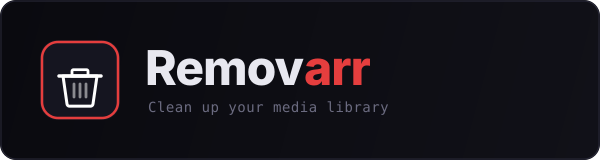

# Removarr

<p align="center">
  
</p>

<p align="center">
  <b>Clean up your media library — one click to delete movies, series, torrents, and files.</b>
</p>

---

> [!IMPORTANT]
> This project was built primarily using **AI-assisted development** (vibe-coded with Claude by Anthropic). It is a personal homelab tool, not a product.

> [!WARNING]
> A basic security review has been performed (Huntarr vulnerability checklist), but **no formal security audit** has been conducted. **Do NOT expose this to the internet** — local network use only.

> [!CAUTION]
> Provided **as-is**, no warranty, no support, no feature requests. Use at your own risk and responsibility. There are probably bugs — I do my best.

---

## Features

### Core
- **Cascade delete**: one click removes the media from Radarr/Sonarr, deletes all matching torrents in qBittorrent (cross-seeds included), and removes files from disk
- Cross-seed detection via Unicode-normalized title matching (handles accents: Yoroï ↔ Yoroi)
- Torrent panel per media: inspect, remove individual torrents, or full delete
- Multi-select with bulk action bar
- Grid view (adjustable card size) + List view

### Integrations
- **Radarr** / **Sonarr** — library management + file deletion
- **qBittorrent** — torrent + file deletion (compatible with v5.2.0+)
- **Plex** — library filter and sort (connect with your Plex token)
- **TMDB** — HD posters + alternate title matching
- **Seerr / Overseerr** — automatic request cleanup on delete
- **Tautulli** — watch history badges (never watched, last watched, play count)

### Performance
- Full library scan of 700 items in **~9 seconds** (inverted word index, multi-level caching)
- TMDB metadata cached on disk, qBittorrent data cached in memory
- Background enrichment with real-time progress widget

### UI/UX
- Setup wizard on first launch (no config files needed)
- Search, filters (Movies / Series / Plex library / Hide no torrent / Never watched), multi-criteria sort (title, size, year, torrents, watch date, added date, library)
- Multilingual (FR / EN + extensible), auto-detects browser language
- Mobile responsive
- Service status indicators with live connectivity checks

### Security
- **Setup wizard** creates admin account on first launch
- Username + password configurable from Settings (stored as SHA-256 hash)
- All API keys and tokens **encrypted at rest** (Fernet/AES-128-CBC) in `settings.json`
- IP whitelist (CIDR support)
- All sensitive fields masked with eye toggle in the UI
- Setup endpoints locked after initial configuration (prevents SSRF)
- Basic security review performed against known *arr stack vulnerabilities

---

## Quick start

```bash
# Create a docker-compose.yml and start
docker compose up -d

# → http://<your-ip>:5999
# The setup wizard will guide you through configuration
```

That's it. No environment variables needed — the setup wizard handles everything.

---

## Installation

### Docker Compose

```yaml
services:
  removarr:
    build: https://github.com/Matt-uSk/removarr.git
    container_name: removarr
    restart: unless-stopped
    ports:
      - "5999:5000"
    volumes:
      - removarr-data:/data    # settings, TMDB cache, posters
    environment:
      - SECRET_KEY=your_random_string   # optional but recommended — openssl rand -hex 32

volumes:
  removarr-data:
```

> **Note**: `SECRET_KEY` is used to encrypt API keys at rest and sign sessions. If not set, a random one is generated on each restart (which invalidates sessions and encrypted keys). Set it once and keep it.

### First launch

1. Open `http://<your-ip>:5999`
2. The setup wizard appears with 3 steps:
   - **Step 1** — Create admin account (username + password)
   - **Step 2** — Configure Radarr, Sonarr, qBittorrent (with live connection test)
   - **Step 3** — Optional services: TMDB (posters), Seerr (requests), Tautulli (watch history), Plex (library filter)
3. Done — you're logged in and the library loads

### Update

```bash
docker compose down && docker compose build --no-cache && docker compose up -d
```

Your settings, cache, and posters are in the `/data` volume — nothing is lost on rebuild.

### Advanced: environment variables

All settings can also be passed as env vars (useful for automation). The setup wizard / Settings page takes priority over env vars.

| Variable | Description |
|---|---|
| `RADARR_URL` / `RADARR_API_KEY` | Radarr connection |
| `SONARR_URL` / `SONARR_API_KEY` | Sonarr connection |
| `QBIT_URL` / `QBIT_USERNAME` / `QBIT_PASSWORD` | qBittorrent connection |
| `TMDB_API_KEY` | TMDB API key or Bearer v4 token |
| `SEERR_URL` / `SEERR_API_KEY` | Seerr/Overseerr connection |
| `TAUTULLI_URL` / `TAUTULLI_API_KEY` | Tautulli connection |
| `PLEX_URL` / `PLEX_TOKEN` | Plex connection (for library filter) |
| `REMOVARR_PASSWORD` | Login password (fallback if not set via UI) |
| `REMOVARR_ALLOWED_IPS` | IP whitelist, e.g. `192.168.0.0/24,10.0.0.1` |
| `SECRET_KEY` | Encryption + session key |
| `CACHE_FILE` | TMDB cache path (default: `/data/tmdb_cache.json`) |

---

## Security

### How credentials are stored

| Data | Method | Reversible |
|---|---|---|
| Removarr password | SHA-256 hash | No (compare only) |
| API keys, tokens & service passwords | Fernet encryption (AES-128-CBC) | Yes (decrypted at runtime) |

All sensitive data in `/data/settings.json` is either hashed or encrypted. Nothing is stored in plain text.

The encryption key is derived from `SECRET_KEY`. If you change or lose it, re-enter your API keys in Settings.

### Security measures

- Authentication with username/password (configurable in setup wizard or Settings)
- IP whitelist support (CIDR ranges)
- All sensitive fields masked in the UI with eye toggle
- Settings API never returns actual values — only `••••••••` placeholders
- Setup endpoints (`/api/setup/*`) locked after initial configuration to prevent abuse
- Basic review performed against the [Huntarr security vulnerability checklist](https://github.com/rfsbraz/huntarr-security-review)

---

## Plex integration

Connect Plex with your `X-Plex-Token` to enable:
- **Library filter** — dropdown to filter media by Plex library (e.g. "Films 4K", "Séries", "Anime")
- **Library sort** — sort your media by library name

To find your Plex token: [Plex support article](https://support.plex.tv/articles/204059436-finding-an-authentication-token-x-plex-token/)

Configure in the setup wizard (step 3) or in Settings → Plex.

---

## Adding a language

1. Copy `template.json` → `locales/de.json`
2. Set `_meta.lang` and `_meta.label` (e.g. `"de"` and `"Deutsch"`)
3. Translate all values (keys must stay identical)
4. Copy into the container: `docker cp locales/de.json removarr:/app/locales/de.json`
5. The language appears automatically in Settings → Language

---

## Persistent data

Mount a volume on `/data`:

| Path | Content |
|---|---|
| `/data/settings.json` | All configuration (encrypted API keys, auth, service URLs) |
| `/data/tmdb_cache.json` | TMDB metadata cache (titles, poster URLs) |
| `/data/posters/` | Downloaded poster images (JPG) |

---

## Tech stack

- **Backend**: Python 3.12 / Flask / Gunicorn (1 worker + 4 threads)
- **Frontend**: Vanilla HTML/CSS/JS — zero external JS dependencies
- **Encryption**: cryptography (Fernet)
- **Fonts**: Inter + JetBrains Mono (Google Fonts)
- **Port**: 5000 internal (mapped to 5999 by default)

---

## API

| Endpoint | Method | Description |
|---|---|---|
| `/api/version` | GET | `{"version": "x.y.z"}` |
| `/api/status` | GET | Service connectivity |
| `/api/config-status` | GET | Setup state |
| `/api/libraries` | GET | Plex library names |
| `/api/media` | GET | Full library from Radarr/Sonarr |
| `/api/media/enrich` | POST | Batch enrichment (posters, torrents, Tautulli, Plex) |
| `/api/delete` | POST | Cascade delete (media + torrents + files) |
| `/api/settings` | GET/POST | Read/write configuration |
| `/api/setup` | POST | Initial setup (first launch only) |
| `/api/setup/test` | POST | Test service connectivity during setup |
| `/api/seerr/requests` | POST | Seerr requests for a media |

---

## Changelog

See [CHANGELOG.md](CHANGELOG.md) for full version history.

---

## License

MIT
